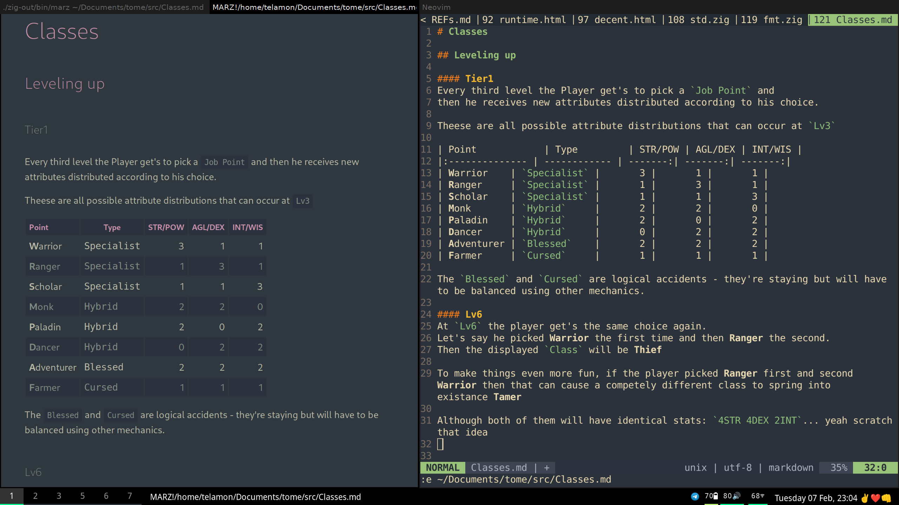

```
 _ __ ___   __ _ _ __ ____
| '_ ` _ \ / _` | '__|_  /
| | | | | | (_| | |   / /
|_| |_| |_|\__,_|_|  /___|
https://discord.gg/8RMRUPZ9RS
```
Markdown Renderer written in Zig using webview.



## Build

```bash
git clone --recurse-submodules https://github.com/telamon/marz
cd marz
zig build
```
If fails, check reqreqs of:
- [webview](https://github.com/webview/webview)
- [koino](https://github.com/kivikakk/koino)

## Use

```
marz README.md
```

**Hotkeys**

- `q` quit
- `r` reload/rerender
- `j` scroll down
- `k` scroll up
- `p` print pdf


---
Licsense: AGPLv3 | DecentLabs 2023

